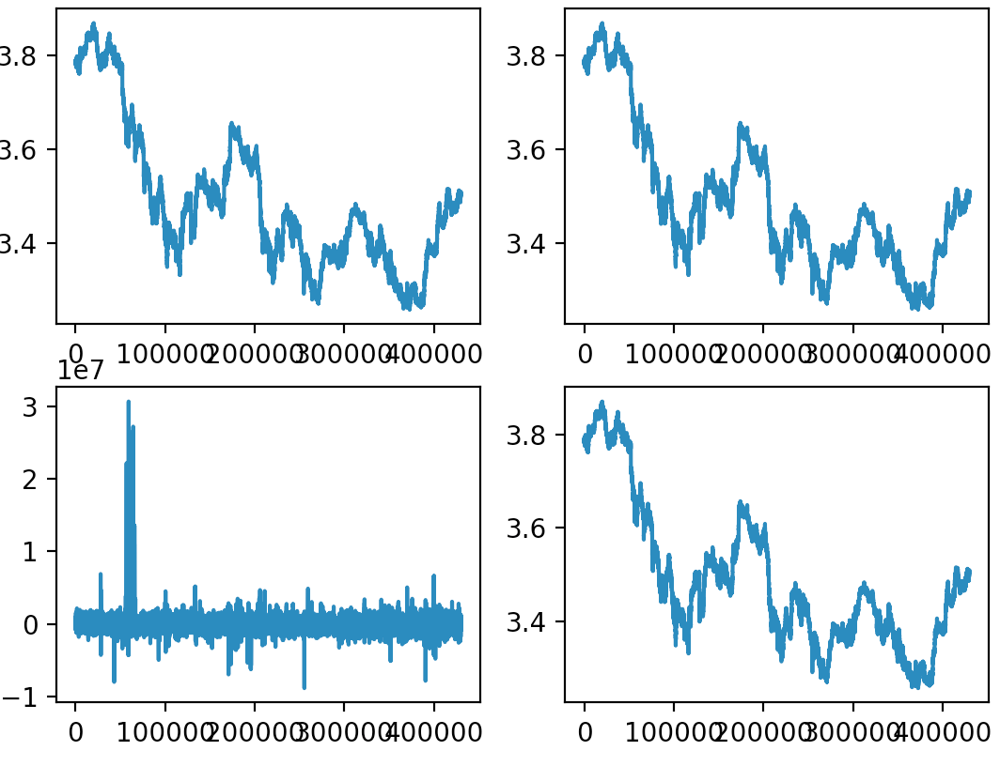
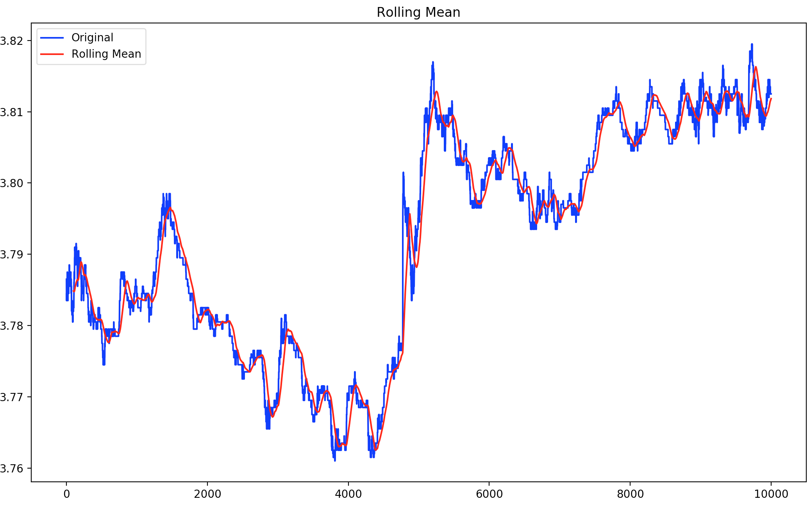
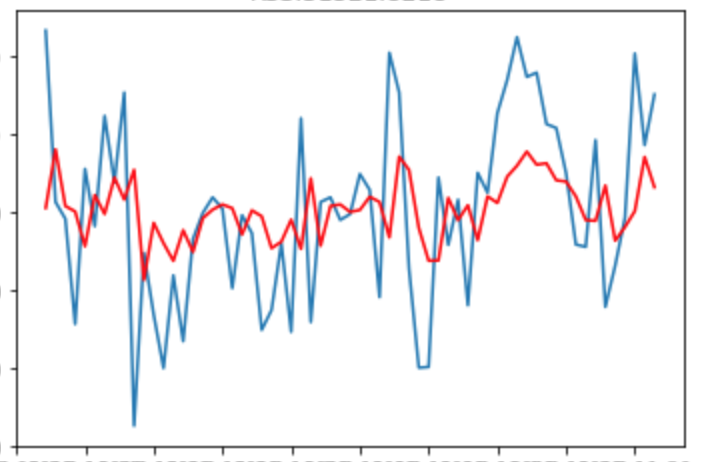
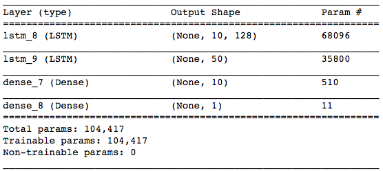
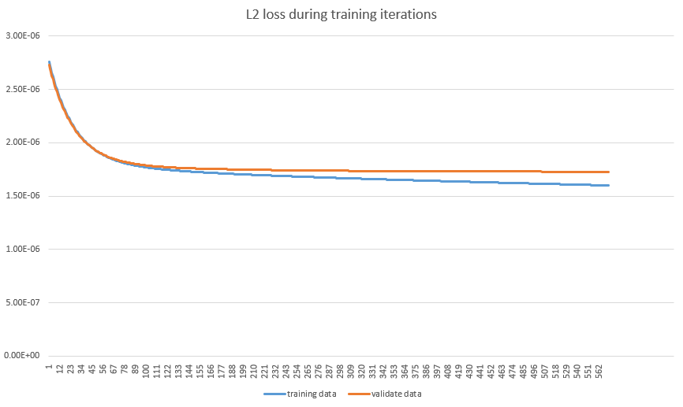

# StockMarketPredicting
Fall 18' Class Project for CS410/EI339 Artificial Intelligence

Kaggle Competition Address <https://www.kaggle.com/c/cs410ei339-fall18-stock-price-prediction>

### Data Preprocessing

Given the data, we of course not begin at the very first time. The first thing we do is to check over the data and do somethingto it to get the proper data. We plot all the graphs inside order book and get the follow result in order to gain an insight into the whole dataset. After that, we will do data preprocessing according to methods in sklearn.preprocessing and others. The whole trend of each features we used are plotted as below, some of the features we don't show since we found them useless.

In the graph, the first one is the MidPrice, i.e the things we are going to predict, the second one and the last one is relatively BidPrice and AskPrice. The third one we choose BidVolume minus AskVolume and it actually has some relationship with our target MidPrice. What's more, we can see there are very strong connections between MidPrice \& BidPrice and AskPrice. After getting that insight, we choose to use the three factors but not to use volume (even the difference of the volume doesn't seem to have connections with MidPrice). According to many time series theory, there are a lot of features can be abstracted in the data, thus we are doing feature engineering secondly.

Thus we are going to do log or other changes to make it satisfied.  After ADF testing, we draw the whole rolling mean graph to see the connectivity between 20-mean values and the first 10 given data. It really shows some tight relationship between the last value of the 10 given data and the 20-mean values. It can also explain why the benchmark is getting a so great result even above some bad LSTM results. The graph is drawn as follow, it's only a part of the whole training set since this can show more on the trend of the data.

### Supervised Learning

It's really some kinds of strange to see a time series problem as a supervised learning problem. However, it did transformed into a supervised learning by the rolling of pandas dataframes. Considering a table below seen as time series, from 1-4, just by stepping up a single step, it gets into a supervised learning problem which we can solve in regressioner provided by sklearn and other tools. By saying stepping up, we just make time 2 value as the label of time 1 value, it goes on time by time.

### LSTM

Recurrent neural network is really a great weapon to deal with time series problems. It make connection between every element, getting a sequence out while input is also the time series sequence. It does well in these years and inside RNN, LSTM is a better method solving the gradient problem of RNN. When it comes to time series problem and neural network, the first thought came out in my mind is this LSTM guy. It did work well as we will show below. To use neural network, data preprocessing is a crucial and essential part of the method. Except for the data preprocessing for all the methods mentioned above, we standardize the data according to z-score function, then we shuffle the whole dataset. As the trial of label in supervised learning, we will predict the difference between the last element of the 10 given and the 20 mean value.

### TCN

TCN is a newly sequence modelling neural network set up by CNN but not RNN. It does better than LSTM in many fields of state-of-art researches. Found that, we decided to try the briefly new method. Naming Temporal Convolutional Network, it is a vague term that could represent a wide range of network architectures. It gets a more explicit receptive field on all data. It really makes better grade when getting deeper because of the certain network structure. The preprocessing is the same as LSTM did since it's really getting a good dataset without bad items.

It's obviously much deeper than the designed LSTM. However, it get the same result as LSTM did. After that, my teammate and I start to consider the real factor that influence the result since we have tried these networks thousands of times. But it can't surmount the line of 148. We think that this may be the bottleneck of Neural Network solutions. Thus, we turned to other methods that not using deep learning knowledgement to do. As we thought, it really helps us take over the 148 benchmark of our own network results.

### Microsoft LightGBM

Some classmates try XGboost, however LGB is much faster than that. It originally bases on boosted tree and tree ensembling. The main insight that makes us decide to continue trying LGB is that it really takes good regression if we have some good features. Since our feature engineering is good enough, we continue to try LGB by varying leaf numbers and other hyperparameters. It finally gives us the result of 147 surmounting the 148 benchmark made by traditional neural networks. Selection of parameters are finetuned over time by the distinct results of every trial.

Loss during training is as follow.

